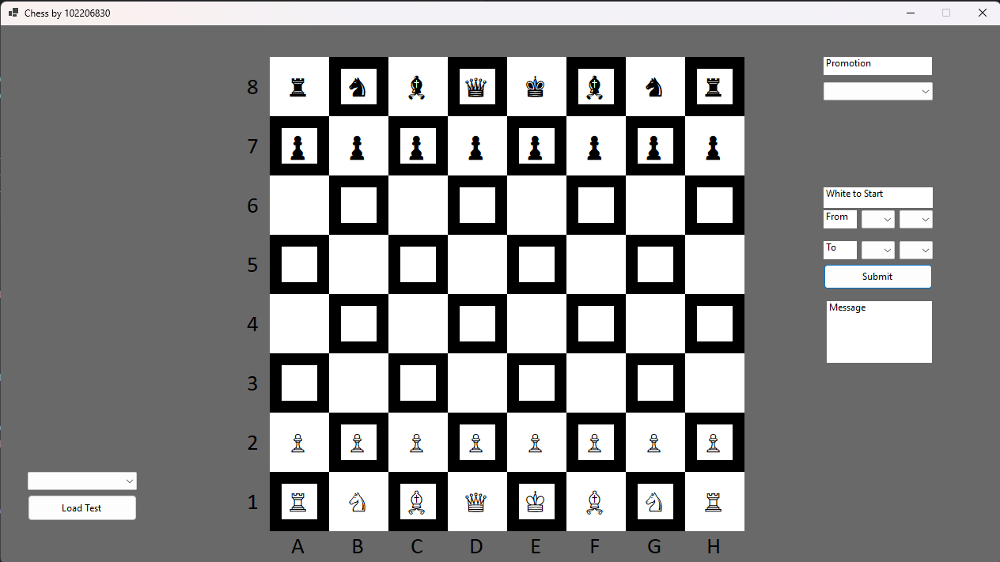

# Chess

## Successes    
- created individual files for Programm components
- Shortened piece list by making for loop for pawns
- Added Chessboard to Form through for loop
- Started Turn Submission Functions

## Issues
Output Terminal doesnt seem to contain ASCII

potential switch to Windows Forms
